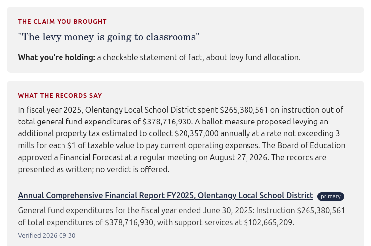
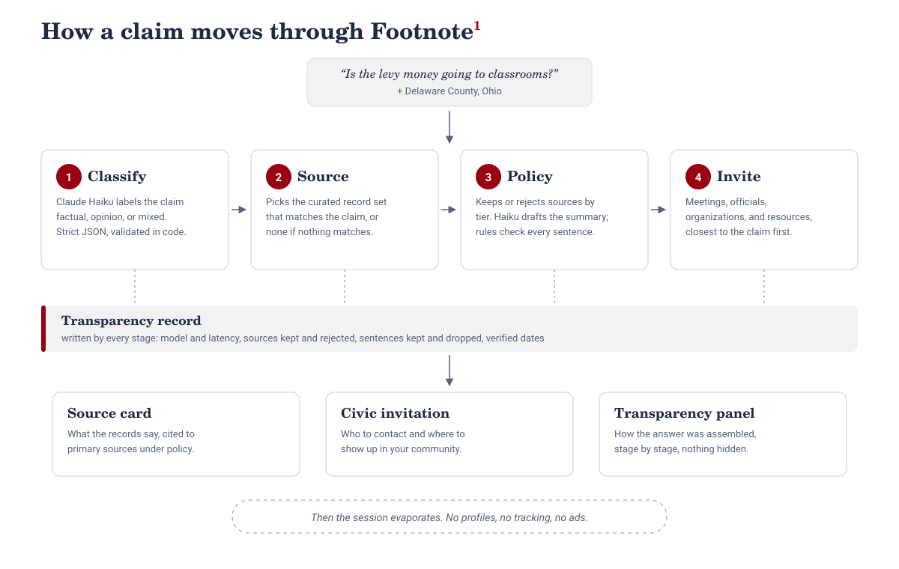

# Footnote

**Bring a claim. See the records. Find the next step. Then it forgets you.**

Footnote helps you deal with claims about your own community. Bring it a statement you've seen ("the levy money is going to classrooms") and pick your locality. It tells you what kind of claim you're holding, shows what the primary records say, shows exactly how that answer was assembled, and hands you the real local next step: the meetings, the officials, the organizations, and the public-records tools. Then the session ends. Nothing is remembered about you, because nothing is collected.

**Live:** https://footnote.alessandrarye.com



## Why this exists

Verification tools stop at the verdict. Civic software is sold to governments, not citizens. The places where claims spread offer neither. Footnote connects the moment of seeing a claim to the moment of doing something about it, under fixed constraints: no profiles, no tracking, no engagement optimization, no advertising, no verdict badges, primary sources first, and a transparency record behind every answer. The constraints aren't limitations. They're the product.

## Features

- **Claim classification.** Claude Haiku labels the claim as a checkable statement of fact, an opinion, or a mix. For a mixed claim, Footnote shows the checkable part. It never rules on whether a claim is true.
- **Source card from real records.** The demo claim is answered from three primary records for Olentangy Local School District: the audited FY2025 financial report, the March 2024 ballot language, and the August 2026 board meeting minutes. Each source links to the document itself and shows the date it was verified.
- **Model-drafted, rule-checked summary.** The model drafts the summary one sentence at a time, each tagged with the source it cites. Plain code then decides which sentences appear (see [The summary checker](#the-summary-checker)).
- **Honest "not yet covered" state.** A claim Footnote has no records for gets no records, rather than records that don't answer it. The card says what Footnote does carry.
- **Civic invitation.** For Delaware County, Ohio: 4 public meetings, 18 officials, 4 organizations, and 6 resources. Every entry shows its source, how many days ago it was verified, and its tier. Entries closest to the claim are listed first.
- **Transparency record.** Every stage logs what it did: which model ran and how long it took, which sources were kept or rejected, and every summary sentence the checker dropped, with the reason.
- **Citation policy.** Strict shows primary records and official communications only. Light also allows established reporting.
- **Sessions evaporate.** No accounts, no database, no cookies, no analytics. Location is declared by the reader, never detected.
- **Works without the model.** With no API key, or if a model call fails, Footnote falls back to a default classification and a hand-written summary, and the transparency record says so.

## How it works



A claim and a locality go through four stages, in order. Each stage appends to the transparency record as it runs.

| Stage       | File                          | What it does                                                                                        | AI  |
| ----------- | ----------------------------- | --------------------------------------------------------------------------------------------------- | --- |
| 1. Classify | `server/pipeline/classify.js` | Labels the claim factual, opinion, or mixed. Strict JSON, validated in code.                        | Yes |
| 2. Source   | `server/pipeline/source.js`   | Picks the curated record set whose topic matches the claim. No match means no sources.              | No  |
| 3. Policy   | `server/pipeline/policy.js`   | Keeps or rejects each source by tier, then builds the summary: model draft, rule check.             | Yes |
| 4. Invite   | `server/pipeline/invite.js`   | Loads the locality's meetings, officials, organizations, and resources, closest to the claim first. | No  |

All model calls go through one file, `server/pipeline/adapter.js`, so the provider can be swapped in one place.

### The summary checker

The model writes the summary. Code decides what you see. Every drafted sentence must pass four rules, or it is dropped and logged:

1. It points to a source that was kept.
2. Every figure in it appears in that source's title or excerpt.
3. It contains no verdict language (true, false, misleading, proves, and so on).
4. It uses an outcome word (approved, passed, failed, rejected, adopted, defeated) only if the cited source uses it.

Rule 4 came from the first test run. The model wrote that voters "approved" the levy while citing the ballot, and a ballot lists the question, not the result. The same word is allowed when the cited source is the board minutes, because the minutes say it.

The closing line, "The records are presented as written; no verdict is offered," is written by code, never by the model.

## Tech stack

| Layer      | What                                                                                                 |
| ---------- | ---------------------------------------------------------------------------------------------------- |
| Frontend   | React 19 with Vite, a single-page app for phone and desktop                                          |
| Backend    | Node.js 22 with Express 5, a small REST API                                                          |
| Model      | Claude Haiku 4.5 through the Anthropic API, behind one adapter                                       |
| Civic data | Version-controlled YAML in `data/localities/`, with a source, tier, and verified date on every entry |
| Storage    | None. Sessions are not stored, and the git history of the data is the audit log                      |
| Hosting    | AWS EC2 (Ubuntu 24.04), nginx, pm2, HTTPS from Let's Encrypt                                         |
| Process    | Feature branches, pull requests into a protected `main`, and a dated [decisions log](./DECISIONS.md) |

## Project structure

```
footnote/
├── client/                  React app (Vite)
│   └── src/App.jsx          the form, the results, the transparency record
├── server/
│   ├── index.js             Express API
│   └── pipeline/            the four stages, the runner, and the model adapter
├── data/localities/         one YAML file per covered locality
├── docs/
│   ├── deploy.md            EC2 deploy runbook
│   ├── tech-notes.md        the stack in depth
│   └── pitch/               deck, script, and screenshots
├── DECISIONS.md             every consequential choice, dated
└── README.md
```

## Running locally

You need **Node.js 22** and npm. An Anthropic API key is optional: without one, Footnote runs on its fallbacks.

**1. Clone and install**

```bash
git clone https://github.com/Alessandrarye/footnote.git
cd footnote
(cd server && npm ci)
(cd client && npm ci)
```

**2. Add your API key (optional)**

```bash
cp server/.env.example server/.env
```

Open `server/.env` and set `ANTHROPIC_API_KEY`. This file is gitignored and must never be committed.

**3. Start the server** (terminal 1)

```bash
cd server
npm start
```

You should see `footnote server on :3001`. Restart it after any change to a server file.

**4. Start the client** (terminal 2)

```bash
cd client
npm run dev
```

Open http://localhost:5173. The dev server proxies `/api` to port 3001 and reloads on its own.

**5. Check it from the command line** (terminal 3)

```bash
curl -s http://localhost:3001/api/health

curl -s -X POST http://localhost:3001/api/claims \
  -H "Content-Type: application/json" \
  -d '{"claim":"The levy money is going to classrooms","localityId":"delaware-county-oh"}'
```

The first prints `"ok":true`. The second returns the full result: classification, source card, civic invitation, and transparency record.

### API

| Method | Path              | Purpose                                                                                      |
| ------ | ----------------- | -------------------------------------------------------------------------------------------- |
| GET    | `/api/health`     | Liveness check                                                                               |
| GET    | `/api/localities` | The covered localities                                                                       |
| POST   | `/api/claims`     | Run a claim. Body: `claim` (text), `localityId`, and optional `policy` (`STRICT` or `LIGHT`) |

### Other commands

```bash
cd client && npm run lint     # ESLint
cd client && npm run build    # production build into client/dist
```

## Deploying

The live site runs on one EC2 instance. First-time setup is in [docs/deploy.md](./docs/deploy.md). An update is:

```bash
ssh -i ~/.ssh/footnote-key.pem ubuntu@<server-ip>
cd ~/footnote && git pull
cd client && npm run build      # only if client files changed
pm2 restart footnote-api
```

Run `npm ci` in `server/` or `client/` first if that folder's `package.json` or `package-lock.json` changed.

## Known limits

- **One locality and one record set.** Delaware County, Ohio, with real records for the Olentangy school levy. Other claims are classified and get the local next step, but no records.
- **Matching a claim to its records is keyword rules,** so a loosely related claim about school money can be shown the levy records.
- **The checker verifies attribution, figures, and wording.** It does not yet verify that a paraphrase keeps the source's meaning.
- **The data is maintained by hand.** Staleness is displayed on every entry rather than hidden.

## Roadmap

- A second claim with its own record set
- A check that a summary sentence keeps its source's meaning
- An automated test suite and CI
- Topic packages, a librarian curation console, and community source submission
- A database, when there is something worth storing

## More

- [DECISIONS.md](./DECISIONS.md): what was chosen and why
- [docs/tech-notes.md](./docs/tech-notes.md): the stack in depth
- [docs/deploy.md](./docs/deploy.md): the deploy runbook

Built by Alee as the capstone for the Metana Full Stack Bootcamp.
